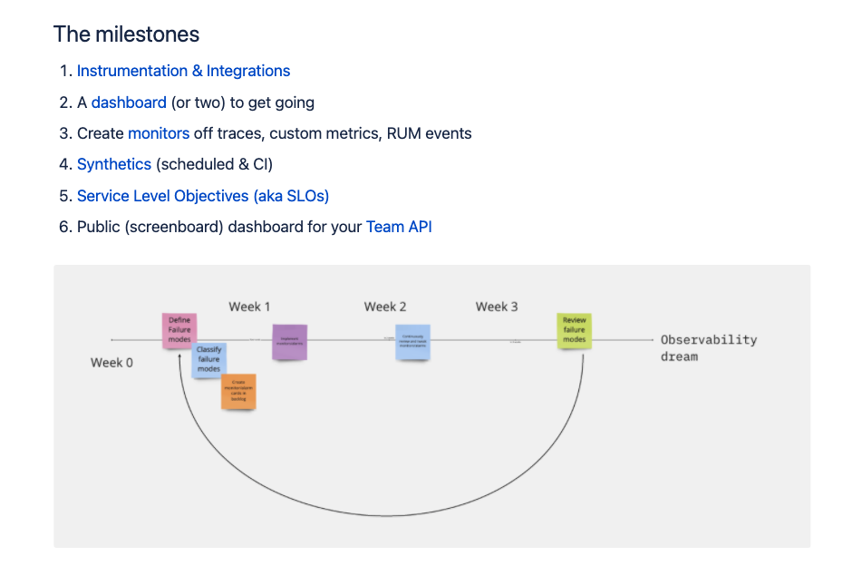

# dashcon-2021-talk

The road to a new architecture: cinch’s journey to serverless

## Abstract

cinch is a UK-based car buying platform that takes the faff out of finding, buying and owning a used car. In scaling the business to a direct-to-consumer model, we took the opportunity in 2020 to move to serverless architecture, restructure our team and shift our culture towards an observability mindset. We applied the ‘Inverse Conway’s Law manoeuvre’ to design an organisation that could create a software system we could iterate over frequently, and with confidence.
We will share our journey of challenges and incremental wins; as we equipped and enabled our engineering teams to live closer to production and become comfortable with our product systems and the telemetry data they emit. From the very start, we had observability principles at the heart of our engineering principles and practices.
By the end of the talk, you will have learned about our Cloud observability journey, what impact it had on our outcomes and how you might apply a similar approach to scale your organisation.

## Bio

Apostolis (Toli) Apostolidis is a Mathematics BSc & Mathematical Sciences MSc graduate turned Software Engineer. Toli learnt to write code the hard way by solving large scale optimisation problems and has since worked across all software stacks and many programming paradigms. More recently, Toli has a spiked interest in DevOps and Observability practices and how he can empower teams to embrace them and enable them to excel at their goals. Toli is currently working as a Principal Engineer at cinch in the UK, focusing on Engineering Practices, particularly around DevOps and Observability.

## Sketch

## 0-5 mins

Problem statement:

- product: what is cinch?
- State Jan 2020: Inherited a software system in Azure - Conway's Law with teams/software shape - [high level overview here]
- March 2020 goal: research, learn, experiment, deliver value, build for scalability
- [At the start of pandemic, saw an opportunity to pivot business model from B2B to also B2C]

## 5-10 mins

Solution:

- engineering principles:
  - team first,
  - product engineering centric org,
  - cross functional, autonomous teams,
  - fast flow, small batches, frequent feedback,
  - no ops teams, no QAs, no SREs, no platform -> DevOps/o11y first
- tech stack: serverless, cloud, AWS, typescript (and why)
- pivot hiring

## 10-15 mins

The Journey

- Org design: Start with teams (Spotify model & Team Topologies):  handful of stream-aligned product engineering teams aligned to domains. Autonomy, ownership, cross-functional
- Tech choices: Choose serverless, AWS, event driven architecture, typescript, React Gatsby (same as before)
  - old services still present
- Testing: automate it all (backend & frontend) - experiment with integration test strategies
- Deployments: not too many fixed environments. Ephemeral environments, dev and prod only. Stay close to production [GitHub Actions] - pipelines close to code (GitHub)
- Observability: start with observability in mind - how are you going to know your software is working in prod? [Standardise on Datadog]

[Talk around diagrams for Software Life Cycle]

Delivered in October 2020 with 6 squads & scaled to  3 tribes & 9 squads

Scaled till October 2021 to X teams, Y tribes

## 15-22 mins

Serverless observability

Use 'The Observability Journey' to talk through the observability journey with serverless

[Talk about practices and patterns that worked well]

- review dashboards after stand ups
- review monitoring and observability weekly
- in hours on call rotas
- observability workshops
- Automation Engineer role in each squad
- Principal Engineers to support
- DevOps Community of Practice
- DORA metrics - measured 2/4 routinely, 2/4 ad hoc!

## 22-25 mins

Final takeaway:

Core message:

- TRUST your teams, trust your software engineers. This is even more important when you are growing entirely remotely.
- Enable them to research, learn, experiment, deliver value and build for scalability.
- Serverless frees teams up to instrument their software systems for optimal observability.
- Be patient - supporting and operating production systems do not come easy to software engineers. Support them
